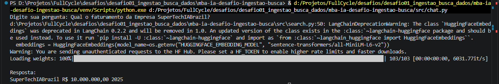
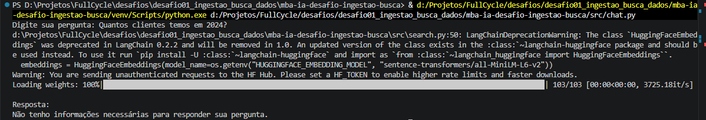

# Desafio MBA Engenharia de Software com IA — Full Cycle

Pipeline RAG (Retrieval-Augmented Generation) que ingere um documento PDF em um banco vetorial e responde perguntas em linguagem natural com base exclusivamente no conteúdo do documento.

---

## Visão geral

A aplicação é dividida em dois fluxos principais:

| Fluxo | Script | Descrição |
|-------|--------|-----------|
| **Ingestão** | `src/ingest.py` | Carrega o PDF, divide em chunks, gera embeddings e persiste no PostgreSQL |
| **Busca / Chat** | `src/search.py` + `src/chat.py` | Recebe uma pergunta, busca chunks relevantes por similaridade e responde via LLM |

### Arquitetura

```
┌────────────┐     PyPDFLoader      ┌──────────────────────┐
│  document  │ ──────────────────►  │  RecursiveCharacter  │
│   .pdf     │                      │    TextSplitter       │
└────────────┘                      │  (chunk 1000 / 150)  │
                                    └──────────┬───────────┘
                                               │ HuggingFace Embeddings
                                               │ all-MiniLM-L6-v2
                                               ▼
                                    ┌──────────────────────┐
                                    │  PostgreSQL + pgvector│
                                    │   (LangChain PGVector)│
                                    └──────────┬───────────┘
                                               │
                         pergunta do usuário   │  similarity_search (k=10)
                                ──────────────►│
                                               │ chunks relevantes
                                               ▼
                                    ┌──────────────────────┐
                                    │  Prompt Template     │
                                    │  + Google Gemini     │
                                    │  (gemini-2.5-flash)  │
                                    └──────────────────────┘
                                               │
                                               ▼
                                         Resposta final
```

---

## Tecnologias

- **LangChain** — orquestração do pipeline RAG
- **HuggingFace Sentence Transformers** (`all-MiniLM-L6-v2`) — geração de embeddings local
- **PostgreSQL + pgvector** — armazenamento e busca vetorial
- **Google Gemini** (`gemini-2.5-flash-lite`) — geração de resposta em linguagem natural
- **Docker / Docker Compose** — provisionamento do banco de dados

---

## Pré-requisitos

- Python 3.11+
- Docker e Docker Compose
- Chave de API do Google AI Studio (`GOOGLE_API_KEY`)

---

## Configuração

### 1. Clone o repositório e crie o ambiente virtual

```bash
git clone <url-do-repositorio>
cd mba-ia-desafio-ingestao-busca

python -m venv venv
# Windows
venv\Scripts\activate
# Linux / macOS
source venv/bin/activate

pip install -r requirements.txt
```

### 2. Configure as variáveis de ambiente

Copie o arquivo de exemplo e preencha com seus valores:

```bash
cp .env.example .env
```

| Variável | Descrição |
|----------|-----------|
| `GOOGLE_API_KEY` | Chave da API do Google AI Studio |
| `GOOGLE_CHAT_MODEL` | Modelo de chat (padrão: `gemini-2.5-flash-lite`) |
| `HUGGINGFACE_EMBEDDING_MODEL` | Modelo de embeddings (padrão: `sentence-transformers/all-MiniLM-L6-v2`) |
| `DATABASE_URL` | URL de conexão com o PostgreSQL |
| `PG_VECTOR_COLLECTION_NAME` | Nome da coleção no pgvector (padrão: `pdf_collection`) |
| `PDF_PATH` | Caminho absoluto para o arquivo PDF a ser ingerido |

### 3. Suba o banco de dados

```bash
docker compose up -d
```

O serviço `bootstrap_vector_ext` cria automaticamente a extensão `vector` no PostgreSQL.

---

## Uso

### Passo 1 — Ingestão do PDF

Execute uma única vez para carregar o documento na base vetorial:

```bash
python src/ingest.py
```

O script irá:
1. Carregar o PDF indicado em `PDF_PATH`
2. Dividir em chunks de 1 000 caracteres com sobreposição de 150
3. Gerar embeddings com o modelo HuggingFace configurado
4. Persistir os vetores no PostgreSQL via `PGVector`

### Passo 2 — Chat com o documento

```bash
python src/chat.py
```

Digite uma pergunta e pressione Enter. O sistema irá:
1. Transformar a pergunta em vetor de embedding
2. Recuperar os 10 chunks mais similares do banco
3. Montar um prompt com o contexto recuperado
4. Enviar ao Google Gemini e exibir a resposta

> O modelo responde **somente com base no conteúdo do documento**. Caso a informação não esteja presente, ele retorna: *"Não tenho informações necessárias para responder sua pergunta."*

---

## Evidências

| Ingestão concluída | Busca respondida |
|:-----------------:|:----------------:|
|  |  |
